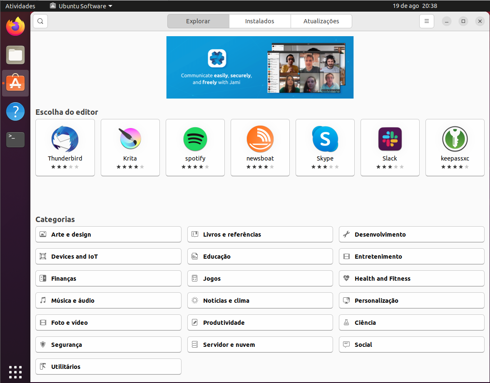
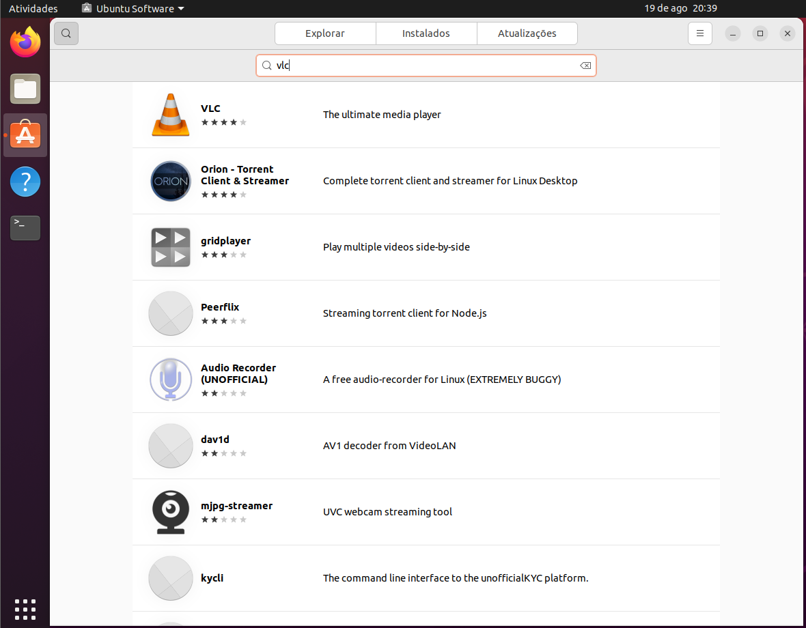
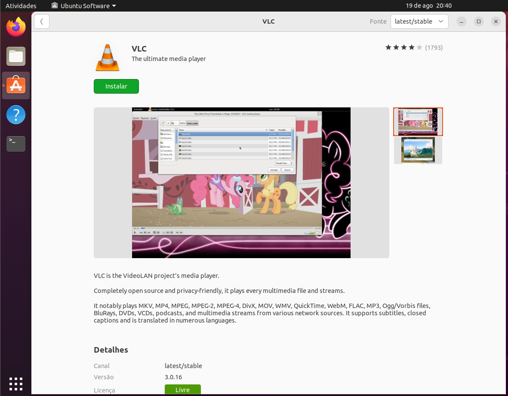
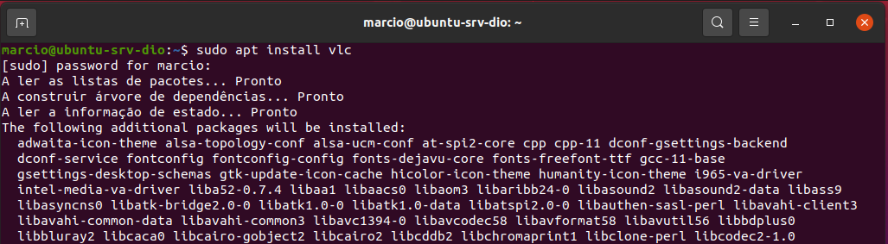
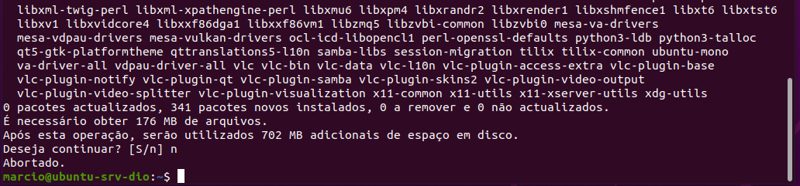
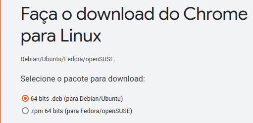
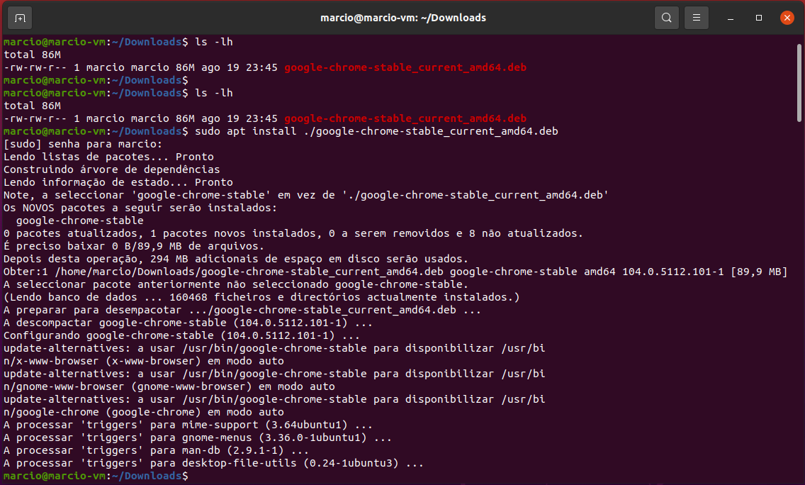
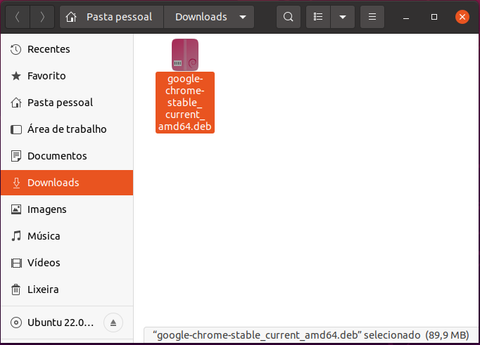
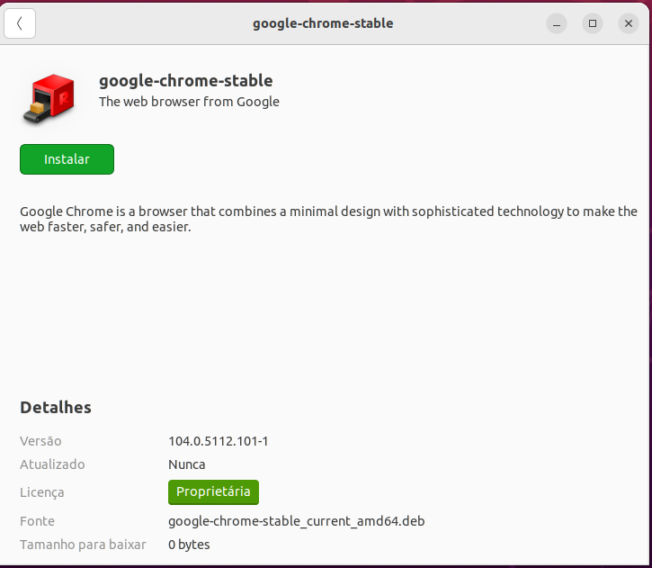
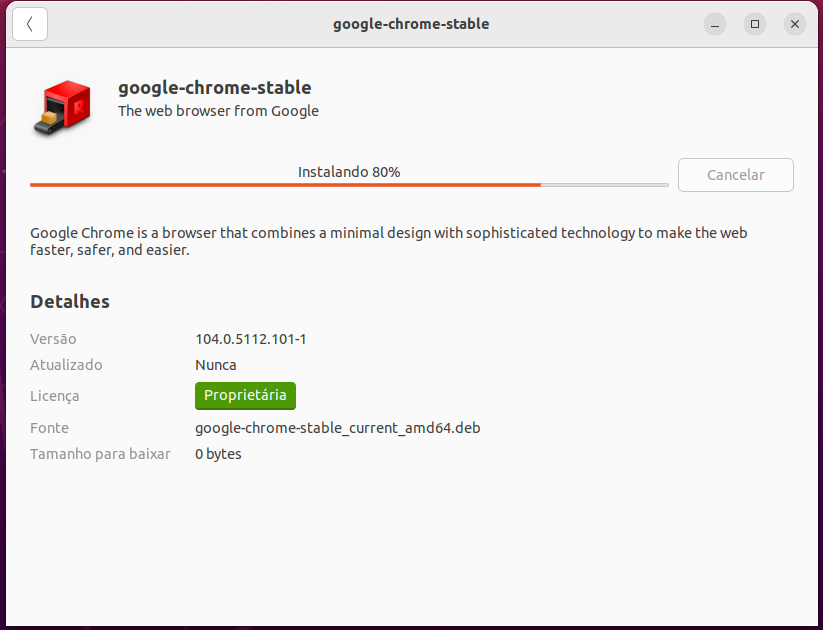

# Gerenciamento de Pacotes Linux

## Gerenciamento de pacotes (UBUNTU-DEBIAN)

O que é um pacote?

Pode ser um software, um driver ou codec de áudio e vídeo. 

 
O **apt-get** é um gerenciador de baixo nível, isso significa que  para se instalar algo, você precisa saber extamente o nome do pacote que quer instalar.

>	root@ubuntu-srv-dio:/# apt-get --help  
>	apt 2.4.7 (amd64)  
>	Usage: apt-get [options] command  
>	&nbsp;&nbsp;&nbsp;&nbsp; apt-get [options] install|remove pkg1 [pkg2 ...]  
>	&nbsp;&nbsp;&nbsp;&nbsp; apt-get [options] source pkg1 [pkg2 ...]  
>	
>	apt-get is a command line interface for retrieval of packages  
>	and information about them from authenticated sources and  
>	for installation, upgrade and removal of packages together  
>	with their dependencies.
>	
>	Most used commands:  
>	 &nbsp;&nbsp;&nbsp;&nbsp; *update - Obter novas listas de pacotes*  
>	 &nbsp;&nbsp;&nbsp;&nbsp; *upgrade - Executar uma actualização*  
>	 &nbsp;&nbsp;&nbsp;&nbsp; *install - Instalar novos pacotes (o pacote é libc6 e não libc6.deb)*  
>	 &nbsp;&nbsp;&nbsp;&nbsp; reinstall - Reinstall packages (pkg is libc6 not libc6.deb)  
>	 &nbsp;&nbsp;&nbsp;&nbsp; remove - Remover pacotes  
>	 &nbsp;&nbsp;&nbsp;&nbsp; *purge - Remover pacotes e ficheiros de configuração*  
>	 &nbsp;&nbsp;&nbsp;&nbsp; autoremove - Remover automaticamente todos os pacotes não utilizados  
>	 &nbsp;&nbsp;&nbsp;&nbsp; dist-upgrade - Actualizar a distribuição, veja apt-get(8)  
>	 &nbsp;&nbsp;&nbsp;&nbsp; dselect-upgrade - Seguir as escolhas feitas no dselect  
>	 &nbsp;&nbsp;&nbsp;&nbsp; build-dep - Configurar as dependências de compilação de pacotes de códigofonte  
>	 &nbsp;&nbsp;&nbsp;&nbsp; satisfy - Satisfy dependency strings  
>	 &nbsp;&nbsp;&nbsp;&nbsp; clean - Apagar ficheiros de arquivo obtidos por download  
>	 &nbsp;&nbsp;&nbsp;&nbsp; autoclean - Apagar ficheiros de arquivo antigos obtidos por download  
>	 &nbsp;&nbsp;&nbsp;&nbsp; check - Verificar se existem dependências erradas  
>	 &nbsp;&nbsp;&nbsp;&nbsp; source - Fazer o download de arquivos de código-fonte  
>	 &nbsp;&nbsp;&nbsp;&nbsp; download - Obter o pacote binário para o directório actual  
>	 &nbsp;&nbsp;&nbsp;&nbsp; changelog - Obter e mostrar o changelog de um pacote  
>	
>	See apt-get(8) for more information about the available commands.  
>	Configuration options and syntax is detailed in apt.conf(5).  
>	Information about how to configure sources can be found in sources.list(5).  
>	Package and version choices can be expressed via apt_preferences(5).  
>	Security details are available in apt-secure(8).  
>	Este APT tem Poderes de Super Vaca.  
>	root@ubuntu-srv-dio:/#  

 
Temos também o **apt**, que é uma atualização do apt-get e possui os seguintes recursos:

>	root@ubuntu-srv-dio:/# apt --help  
>	apt 2.4.7 (amd64)  
>	Usage: apt [options] command  
>	
>	apt is a commandline package manager and provides commands for  
>	searching and managing as well as querying information about packages.  
>	It provides the same functionality as the specialized APT tools,  
>	like apt-get and apt-cache, but enables options more suitable for  
>	interactive use by default.  
>	
>	Most used commands:  
>	 &nbsp;&nbsp;&nbsp;&nbsp;  *list - list packages based on package names*  
>	 &nbsp;&nbsp;&nbsp;&nbsp;  *search - search in package descriptions*  
>	 &nbsp;&nbsp;&nbsp;&nbsp;  show - show package details  
>	 &nbsp;&nbsp;&nbsp;&nbsp;  install - install packages  
>	 &nbsp;&nbsp;&nbsp;&nbsp;  reinstall - reinstall packages  
>	 &nbsp;&nbsp;&nbsp;&nbsp;  remove - remove packages  
>	 &nbsp;&nbsp;&nbsp;&nbsp;  autoremove - Remover automaticamente todos os pacotes não utilizados  
>	 &nbsp;&nbsp;&nbsp;&nbsp;  update - update list of available packages  
>	 &nbsp;&nbsp;&nbsp;&nbsp;  upgrade - upgrade the system by installing/upgrading packages  
>	 &nbsp;&nbsp;&nbsp;&nbsp;  full-upgrade - upgrade the system by removing/installing/upgrading packages  
>	 &nbsp;&nbsp;&nbsp;&nbsp;  edit-sources - edit the source information file  
>	 &nbsp;&nbsp;&nbsp;&nbsp;  satisfy - satisfy dependency strings  
>	
>	See apt(8) for more information about the available commands.   
>	Configuration options and syntax is detailed in apt.conf(5).  
>	Information about how to configure sources can be found in sources.list(5).  
>	Package and version choices can be expressed via apt_preferences(5).  
>	Security details are available in apt-secure(8).  
>	Este APT tem Poderes de Super Vaca.  
>	root@ubuntu-srv-dio:/#  

 
Verificar os pacotes instalados atualmente:

>   root@ubuntu-srv-dio:/# apt list --installed

 
Verificar se um pocte específico está instalado:

>   root@ubuntu-srv-dio:/# apt list --installed | grep nano  
>   nano/jammy,now 6.2-1 amd64 [installed,automatic]

 
Lista de pacotes atualizáveis:

>   root@ubuntu-srv-dio:/# apt list --upgradable

 
Buscar pacotes por nome:

>   root@ubuntu-srv-dio:/# apt search samba

 
Caso tenha a necessidade de instalar um paocte que esteja em um novo repositório ainda não disponível, pode-se adicionar este novo repositório no arquivo:

>   root@ubuntu-srv-dio:/Downloads# apt edit-sources

 

## Atualização dos aplicativos do sistema operacional

 
Lembre-se sempre de efetuar o backup/snapshot antes de executar atualizações de sistema, seja Linux ou Windows. No nosso servidor o update é feito das maneira abaixo:

> Primeiro, atualizar a lista de pacotes disponíveis:  
> root@ubuntu-srv-dio:/# apt update  
> &nbsp;&nbsp;&nbsp;&nbsp;  apt update - update list of available packages  
>
> Em seguida, fazer a atualização de fato:  
> root@ubuntu-srv-dio:/# apt upgrade  
> &nbsp;&nbsp;&nbsp;&nbsp; apt upgrade - upgrade the system by installing/upgrading packages  

 
Para realizar a atualização da versão do Ubuntu istalado:

>	root@ubuntu-srv-dio:/# apt-get dist-upgrade  
>	 &nbsp;&nbsp;&nbsp;&nbsp; dist-upgrade - Actualizar a distribuição, veja apt-get(8)  

 

## Instalação de pacotes no ambiente Desktop

 
No ambiente desktop Ubuntu, temos a loja de aplicativos, semelhante a loja de aplicativos do Windows:

 
Para Instalar um aplicativo, basta pesquisar o aplicativo desejado:

 
E clicar em instalar:

 
Mas claro, também é possivel realizar a instalação através do nosso bom e velho terminal, a diferença é que via terminal podemos ver todas as dependências que serão instaladas junto com o pacote principal:

  

 

## Gerenciamento de pacotes (FEDORA / RED HAT (RHEL) / CenTOS)

 
Nos sistemas RedHat based, existem dois genreciadores de pacotes:

>	#dnf  
>	&nbsp;&nbsp; (mais "user friendly") 
>	ou o  
>	#yum 
>	&nbsp;&nbsp; (mais utilizado em scripts)

 
Exemplo dnf:

>	#dnf search net-tools  
>	#dnf install net-tools -y  
>	#dnf remove net-tools  

  
Exemplo yum:

>   #yum install httpd

ATENÇÃO:  
O **dnf update** não precisa atualizar os repositórios antes.

 

## Realizando a instalação de arquivos DEB

 
Diferente dos executáveis do Windows que tem como extensão .exe e .msi para instaladores de arquivos, no Linux temos as extensões .deb para sistemas Debian based e a extensão .rpm para RedHat based.  
 
Esses aplicativos podem ser instalados também via terminal ou duplo clique.

  

Instalação via terminal:  
  

Instalação padrão windows:  
  
  

Diferente da instalação via terminal, o usuário não vê a instalação dos pacotes adicionais de dependência, apenas a porcentagem do progresso da instalação:  
  